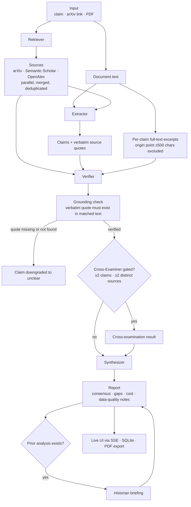

# PaperAgents

**A multi-agent citation verification desk.** Four specialists work in parallel to check whether a paper's claims actually hold up against the literature — a Retriever finds sources, an Extractor isolates claims, a Verifier checks each one against real source text **and the paper's own full text**, and a Synthesizer files the final report. A Cross-Examiner checks sources for disagreement, and a Historian remembers what changed since your last visit.

Every "supported" verdict is backed by a verbatim quote that's mechanically checked against the retrieved source text in code — not just asserted by the model. Built for the Research Agents Hack (IIT Madras, August 2026).

---

## What it does

Give PaperAgents a research claim, an arXiv link, or a PDF. It will:

1. **Retrieve** — search arXiv, Semantic Scholar, and OpenAlex in parallel, merge and deduplicate results, and flag any source independently confirmed by more than one database
2. **Extract** — pull every citation-attributed claim from the input, along with the exact quote and citation label it came from
3. **Verify** — check each claim against the retrieved sources' actual text and, for PDF/full-document runs, against the paper's own full text too. Each claim's *origin point* (the sentence its quote was extracted from, plus 500 characters around it) is structurally removed from the document before the Verifier sees it, so a claim can only be confirmed by a *different* part of the same paper — self-consistency, never self-matching. Every "supported" or "fabricated" verdict requires a verbatim evidence quote, which is checked programmatically against the matched text before the verdict is allowed to stand. If the quote isn't really there, the claim is downgraded to "unclear" — regardless of what the model's reasoning says.
4. **Cross-examine** — check whether independently retrieved sources actually agree with each other on the same subject, surfacing genuine contradictions rather than manufacturing disagreement where none exists
5. **Synthesize** — produce a plain-language consensus, a list of evidence gaps, and (if you've analyzed this paper before) a Historian briefing on what changed since last time

Every run also discloses its own data quality — if a source API failed, an agent timed out, or extraction had to retry, the final report says so explicitly rather than presenting a degraded run as clean.

---

## Architecture

```
Next.js app
├── /                    landing page (the pitch)
├── /analyze             the product — paste a claim, upload a PDF, watch the pipeline run
├── /analyze/api/run     SSE endpoint: orchestrates all 6 steps, streams live events
├── /analyze/api/session restores the last completed analysis on page reload
├── /analyze/api/export-pdf   generates a downloadable PDF of any report
└── SQLite (better-sqlite3, on a persistent volume in production)
    └── analyses         one row per completed run — input, full report JSON, timestamps
        (powers session restore and the Historian's "since last time" comparisons)
```

### Pipeline flow



*For plain claim/arXiv input there is no document text — the Extractor reads retrieved abstracts instead and full-text self-verification is skipped.*

### The pipeline

| Step | Role | Model (default) |
|---|---|---|
| Retriever | Generates search queries, fetches from arXiv, Semantic Scholar, and OpenAlex in parallel, merges duplicates across sources | `deepseek/deepseek-chat` |
| Extractor | Isolates every citation-attributed claim, with its verbatim source quote and citation label | `deepseek/deepseek-chat` |
| Verifier | Checks each claim against retrieved source text and (for PDF/full-document runs) the paper's own full text with each claim's origin point excluded; requires a real, checkable quote for any "supported"/"fabricated" verdict | `deepseek/deepseek-chat` |
| Cross-Examiner | Compares evidence across multi-source-confirmed claims for genuine disagreement | `deepseek/deepseek-chat` |
| Synthesizer | Writes the final consensus, gap list, and cost rollup | `deepseek/deepseek-chat` |
| Historian | If this paper/claim was analyzed before, diffs the new verdicts against the prior run | `deepseek/deepseek-chat` |

All five agents run on the same consistent model tier (`deepseek/deepseek-chat`) by design — a single cheap, predictable cost profile end to end, with no premium mode.

### Full-text self-verification

When you upload a PDF or paste a full document, the paper's own extracted text becomes an additional, always-available evidence source — no external retrieval required. For each claim, the Verifier receives an excerpt of the document (capped at ~7,000 characters) with the claim's **origin point removed**: the exact sentence its `sourceQuote` was pulled from, plus 500 characters around it, is cut out *before* the model ever sees the text. The claim can therefore only be supported by a **different** part of the same paper (a numeric detail restated in the methods section, a decoder description confirming an encoder claim, …) — never by quoting itself back. This is a structural exclusion applied in code, not a prompt instruction.

The same deterministic grounding check that guards external verdicts applies to in-paper ones: the model's `evidenceQuote` must exist verbatim in the claim's own excerpt, and a source-attribution pass relabels quotes that came from the document but were mis-attributed to an external paper's title. Because self-consistency is weaker evidence than external corroboration, the report and the PDF export label the two differently — `[In paper] Source Document (full text, cross-referenced)` vs `[External] …` — and in-paper verdicts also show how far the evidence sits from the claim's origin point (a character distance), so you can judge the cross-reference yourself.

---

## Powered by Runtime (BTL)

All LLM calls are routed through **[Runtime](https://rntm.sh)** (formerly Bad Theory Labs), an OpenAI-compatible inference gateway, with **OpenRouter as the primary provider and Runtime's own gateway as an automatic fallback** if the primary is unavailable.

Runtime provides:

- **Prompt caching** — each agent uses a fixed, versioned system prompt (`retriever-v1`, `verifier-v4`, etc.) paired with a stable cache key, so repeated calls on the same prompt structure can hit cache instead of paying full inference cost. Observed live: a cached call returned `benchmark: $0.000432 / charge: $0.000216` — roughly half the uncached cost on that call.
- **Per-call cost telemetry** — every response carries benchmark cost, actual charge, and cache tier, which PaperAgents surfaces live in the UI's cost meter and persists in every saved report.
- **Provider-level resilience** — if OpenRouter is unreachable or out of credits, calls automatically retry against Runtime's own gateway (`api.rntm.sh`) with a documented model-name mapping, so a single provider outage doesn't take down the whole pipeline. This fallback path was validated live during development when the OpenRouter account temporarily ran out of credits — calls transparently continued via Runtime's `deepseek-v4-flash`.
- **Per-attempt timeouts within the fallback chain** — if the first model in a call's chain hangs (observed live with `qwen/qwen-2.5-72b-instruct` on OpenRouter, which intermittently hung with no response), a 40-second per-attempt cap (raised from 25s when the verifier's full-document excerpts made its prompt ~4x larger) forces the chain to move to the next model rather than blocking the whole request.
- **Per-agent outer timeouts** — each agent call is additionally capped so a genuinely hung call fails fast and degrades gracefully instead of blocking the pipeline: 60s for the Extractor and Verifier (the two largest prompts), 45s for the Retriever, Synthesizer, Cross-Examiner, and Historian. Extractor, Verifier, and Synthesizer timeouts surface in the report's data-quality notes; the Retriever's query-generation timeout is silent by design, and a Cross-Examiner or Historian failure degrades to a skipped or templated stage.

This is why the cost meter and per-agent cost breakdown in every PaperAgents report are real, measured numbers — not estimates.

---

## Setup

```bash
npm install
cp .env.example .env.local   # fill in your keys, see below
npm run dev                  # http://localhost:3000
```

### Environment variables

| Variable | Required | Notes |
|---|---|---|
| `OPENROUTER_API_KEY` | Yes (or `RUNTIME_API_KEY`) | Primary LLM provider |
| `RUNTIME_API_KEY` | Yes (or `OPENROUTER_API_KEY`) | Fallback LLM provider (`api.rntm.sh`) |
| `SEMANTIC_SCHOLAR_API_KEY` | Recommended | Raises rate limits significantly; the app works without it but is more prone to throttling |
| `DB_PATH` | No | SQLite file location; defaults to `./data/paperagents.db`. Set this to a mounted volume path in production. |

At least one of `OPENROUTER_API_KEY` / `RUNTIME_API_KEY` must be set. Both is recommended, since that's what enables the fallback chain.

### Testing the pipeline directly

```bash
npm run test:pipeline                          # runs against a default test claim
npm run test:pipeline:pdf -- "<path-to-pdf>"    # runs against a real PDF
npm run test:pipeline:pdf -- "<path-to-pdf>" "<claim or topic>"
```

---

## Deployment

PaperAgents runs a **persistent server process**, not serverless functions — the pipeline can take 60–150+ seconds end to end across all six steps, and it writes to a local SQLite file for session restore and Historian comparisons. Both of these are a poor fit for ephemeral serverless platforms (Vercel's function timeout and read-only filesystem in particular).

**Recommended: [Railway](https://railway.app)**, or any platform that runs a persistent Node process with an attached persistent volume.

1. Connect the GitHub repo — Railway auto-detects the Next.js app via `railway.json`
2. Set environment variables in the service's Variables tab
3. Attach a persistent volume, mounted at the path `DB_PATH` points to (e.g. `/data`)
4. Deploy — the healthcheck hits `/`, which returns 200 once the app is up (`railway.json` pins the RAILPACK build, `npm run start`, a 300-second healthcheck timeout, and an on-failure restart policy — nothing to configure on your side)

If you deploy to Vercel anyway, note that `maxDuration` in `app/analyze/api/run/route.ts` needs to be raised well past its current setting to survive a full six-step run, and you'll need external persistent storage (not local SQLite) for session restore and Historian to work correctly.

---

## Known limitations

One worth knowing up front: **full-text self-verification only reaches as far as the Extractor did** — it reads the first 12,000 characters of the document, so a claim whose origin sentence lies beyond that window (or was paraphrased beyond recognition) gets no origin-point exclusion and must rely on the prompt-level rule alone.

See `REPRODUCIBILITY.md` for the full list, including literature-source coverage gaps for very recently published papers, retrieval variance run-to-run, and the scope of the automated grounding check.

---

## License / Credits

Built for the Research Agents Hack (IIT Madras). Sources: arXiv, Semantic Scholar, OpenAlex. Inference: Runtime (OpenRouter primary, Runtime gateway fallback).
