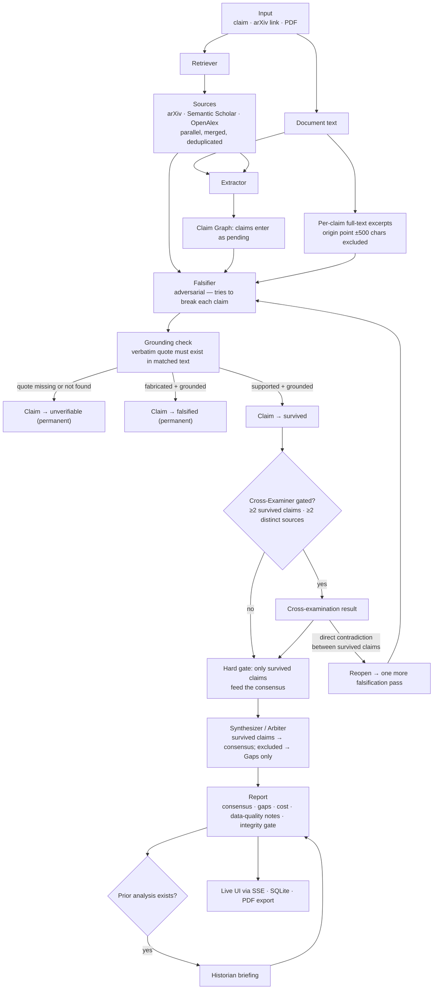

# PaperAgents

**A constrained multi-agent citation verification desk.** Four specialists work through a shared **Claim Graph** — no free-text handoff between stages — to check whether a paper's claims actually hold up against the literature: a Retriever finds sources, an Extractor isolates claims into the graph, a **Falsifier** tries to *break* each claim against real source text **and the paper's own full text**, and a Synthesizer (Arbiter) files the final report from only the claims that survived. A Cross-Examiner checks sources for disagreement (and can force one re-challenge pass), and a Historian remembers what changed since your last visit.

Every "supported" verdict is backed by a verbatim quote that's mechanically checked against the retrieved source text in code — not just asserted by the model. Built for the Research Agents Hack (IIT Madras, August 2026).

---

## What it does

Give PaperAgents a research claim, an arXiv link, or a PDF. It will:

1. **Retrieve** — search arXiv, Semantic Scholar, and OpenAlex in parallel, merge and deduplicate results, and flag any source independently confirmed by more than one database
2. **Extract** — pull every citation-attributed claim from the input (as `pending` nodes in the Claim Graph), along with the exact quote and citation label it came from
3. **Falsify** — try to *break* each claim against the retrieved sources' actual text and, for PDF/full-document runs, against the paper's own full text too. Each claim's *origin point* (the sentence its quote was extracted from, plus 500 characters around it) is structurally removed from the document before the Falsifier sees it, so a claim can only be confirmed by a *different* part of the same paper — self-consistency, never self-matching. Every "supported" or "fabricated" verdict requires a verbatim evidence quote, which is checked programmatically against the matched text before the verdict is allowed to stand. If the quote isn't really there, the claim is automatically downgraded to "unverifiable" — regardless of what the model's reasoning says. Only claims that survive both the adversarial pass and the deterministic grounding check reach `survived` in the graph; everything else is `falsified` or `unverifiable`, permanently, for that run.
4. **Cross-examine** — check whether independently retrieved sources actually agree with each other on the same subject, surfacing genuine contradictions rather than manufacturing disagreement where none exists. A direct contradiction between two *survived* claims reopens them (`under_challenge`) for exactly one more falsification pass before the gate is re-applied
5. **Synthesize (Arbiter)** — produce a plain-language consensus, a list of evidence gaps, and (if you've analyzed this paper before) a Historian briefing on what changed since last time. The Arbiter is hard-gated: it may only reason from `survived` claims, and every other claim goes to the Gaps section — never the conclusions

Every run also discloses its own data quality — if a source API failed, an agent timed out, or extraction had to retry, the final report says so explicitly rather than presenting a degraded run as clean.

---

## A constrained multi-agent system, not a linear pipeline

Agents never pass free text to each other. All state flows through the **Claim Graph** (`lib/claim-graph.ts`), one node per claim, with a lifecycle enforced **in code** (not just in prompts):

```
pending ──▶ under_challenge ──▶ survived ──▶ (terminal; only "survived" can be re-opened)
    │             │                └── groundingCheckPassed === true  →  may ground the consensus
    └──▶ falsified ──────────────▶ (terminal, permanent for the run)
    └──▶ unverifiable ────────────▶ (terminal, permanent for the run)
```

- The **Extractor** is the only writer at creation time, and it can only ever create `pending` claims.
- The **Falsifier** is the only agent that may move a claim to a terminal status (`survived` / `falsified` / `unverifiable`) — via `ClaimGraph.resolveFalsifierVerdict`, the single writer, after its verdict and the deterministic grounding check have been applied.
- The **Synthesizer / Arbiter** may only *read* claims where `status === "survived" && groundingCheckPassed === true` — that is the entire content of its consensus input. Excluded claims go only to the Gaps section.
- `falsified` and `unverifiable` are **permanent for the run**: not even the Cross-Examiner's re-challenge loop can reopen them. Only `survived` claims can be set back to `under_challenge`.

The UI shows this autonomy live: claim badges (`PENDING → UNDER CHALLENGE → SURVIVED / FALSIFIED / UNVERIFIABLE`) update from SSE snapshots as the run progresses, the report opens with a **Scientific Integrity Gate** banner, and every claim row carries both its Falsifier verdict and its graph status.

## Architecture

```
Next.js app
├── /                    landing page (the pitch)
├── /analyze             the product — paste a claim, upload a PDF, watch the pipeline run
├── /analyze/api/run     SSE endpoint: orchestrates all 6 steps, streams live events
├── /analyze/api/session restores the last completed analysis on page reload
├── /analyze/api/export-pdf   generates a downloadable PDF of any report
└── SQLite (better-sqlite3, on a persistent volume in production)
    └── analyses         one row per completed run — input, full report JSON, timestamps
        (powers session restore and the Historian's "since last time" comparisons)
```

### Pipeline flow



*For plain claim/arXiv input there is no document text — the Extractor reads retrieved abstracts instead and full-text self-verification is skipped.*

### The pipeline

| Step | Role | Model (default) |
|---|---|---|
| Retriever | Generates search queries, fetches from arXiv, Semantic Scholar, and OpenAlex in parallel, merges duplicates across sources | `openai/gpt-oss-20b:free` |
| Extractor | Isolates every citation-attributed claim into the Claim Graph (status `pending`), with its verbatim source quote and citation label | `openai/gpt-oss-20b:free` |
| Falsifier | Adversarial claim breaking: tries to falsify each claim against retrieved source text and (for PDF/full-document runs) the paper's own full text with each claim's origin point excluded; requires a real, checkable quote for any "supported"/"fabricated" verdict, then applies the grounding + status gate (only agent that can move a claim to `survived`/`falsified`/`unverifiable`) | `nvidia/nemotron-3-super-120b-a12b:free` (`nvidia/nemotron-3-ultra-550b-a55b:free` on full-document runs) |
| Cross-Examiner | Compares evidence across survived multi-source claims for genuine disagreement; direct contradictions trigger one re-challenge pass | `openai/gpt-oss-20b:free` |
| Synthesizer (Arbiter) | Writes the final consensus from **only** claims that survived the integrity gate, plus the gap list (excluded claims) and cost rollup | `openai/gpt-oss-20b:free` |
| Historian | If this paper/claim was analyzed before, diffs the new verdicts against the prior run | `openai/gpt-oss-20b:free` |

All inference runs on OpenRouter `:free` models by design — actual cost is **$0.00** end to end, with no premium mode. Every agent uses `openai/gpt-oss-20b:free` by default; the Falsifier upgrades to a stronger-reasoning model (`nvidia/nemotron-3-super-120b-a12b:free`) and, when full-document excerpts make its prompt ~4x larger, to a long-context model (`nvidia/nemotron-3-ultra-550b-a55b:free`). If a preferred model hangs or is rate-limited, the call falls through `poolside/laguna-xs-2.1:free` and `openrouter/free` — still free. If OpenRouter itself is unavailable, calls fall back to the BTL gateway (see below).

### Full-text self-verification

When you upload a PDF or paste a full document, the paper's own extracted text becomes an additional, always-available evidence source — no external retrieval required. For each claim, the Falsifier receives an excerpt of the document (capped at ~7,000 characters) with the claim's **origin point removed**: the exact sentence its `sourceQuote` was pulled from, plus 500 characters around it, is cut out *before* the model ever sees the text. The claim can therefore only be supported by a **different** part of the same paper (a numeric detail restated in the methods section, a decoder description confirming an encoder claim, …) — never by quoting itself back. This is a structural exclusion applied in code, not a prompt instruction.

The same deterministic grounding check that guards external verdicts applies to in-paper ones: the model's `evidenceQuote` must exist verbatim in the claim's own excerpt, and a source-attribution pass relabels quotes that came from the document but were mis-attributed to an external paper's title. Because self-consistency is weaker evidence than external corroboration, the report and the PDF export label the two differently — `[In paper] Source Document (full text, cross-referenced)` vs `[External] …` — and in-paper verdicts also show how far the evidence sits from the claim's origin point (a character distance), so you can judge the cross-reference yourself.

---

## Powered by free-tier OpenRouter models

All LLM calls are routed through **[OpenRouter](https://openrouter.ai)** on `:free` models — the actual cost of every PaperAgents run is **$0.00** as long as OpenRouter answers. If OpenRouter is unreachable or the free tier is exhausted, calls fall back to **[Runtime](https://rntm.sh)** (`api.rntm.sh`), a cheap per-use OpenAI-compatible gateway billed well below OpenRouter's paid tier — a resilience safety net, not a free path (a fallback run shows a small non-zero charge in the cost meter).

Why this works:

- **Free-tier-only primary chain** — every agent runs on a free model (`openai/gpt-oss-20b:free` by default; the Verifier uses `nvidia/nemotron-3-super-120b-a12b:free`, and `nvidia/nemotron-3-ultra-550b-a55b:free` for full-document runs whose prompts are ~4x larger). The OpenRouter fallback chain (`openai/gpt-oss-20b:free` → `poolside/laguna-xs-2.1:free` → `openrouter/free`) is free-only too, so even a degraded run on OpenRouter costs nothing. Free model availability rotates; `openrouter/free` auto-routes to whatever free model is available.
- **Per-call cost telemetry** — every response carries usage cost (always $0 on free models), which PaperAgents surfaces live in the UI's cost meter and persists in every saved report. The meter reads $0.00 end to end on the OpenRouter path.
- **Provider-level resilience (BTL fallback)** — if every model in the OpenRouter chain fails, calls automatically retry against Runtime's own gateway (`api.rntm.sh/v1`, models `btl-2` / `deepseek-v4-flash`) with a documented model-name mapping, so a free-tier outage or an exhausted daily rate limit doesn't take down the pipeline. This requires a **currently-valid `RUNTIME_API_KEY`** issued from a Runtime workspace (rntm.sh → create workspace → API key); a stale key from the old `badtheorylabs.com` era returns `404 Application not found` and the fallback silently fails (the error surfaces as "Both providers failed").
- **Prompt caching (BTL path)** — the BTL fallback supports Runtime's `prompt_cache_key` mechanism, so repeated calls on the same prompt structure can hit cache instead of paying full inference cost (OpenRouter does not support the same mechanism).
- **Per-attempt timeouts within the fallback chain** — if the first model in a call's chain hangs (observed live with `qwen/qwen-2.5-72b-instruct` on OpenRouter, which intermittently hung with no response), a 40-second per-attempt cap (raised from 25s when the falsifier's full-document excerpts made its prompt ~4x larger) forces the chain to move to the next model rather than blocking the whole request.
- **Per-agent outer timeouts** — each agent call is additionally capped so a genuinely hung call fails fast and degrades gracefully instead of blocking the pipeline: 60s for the Extractor and Falsifier (the two largest prompts), 45s for the Retriever, Synthesizer, Cross-Examiner, and Historian. Extractor, Falsifier, and Synthesizer timeouts surface in the report's data-quality notes; the Retriever's query-generation timeout is silent by design, and a Cross-Examiner or Historian failure degrades to a skipped or templated stage.

### Free-tier rate limits

Verified against OpenRouter's official docs and a live account check (`GET /api/v1/key`): free-model usage is capped **account-wide** — not per model — at **50 requests/day and 20 requests/minute** when lifetime credits are under $10, rising to **1,000 requests/day** (still 20 req/min) once the account has ever purchased at least $10 of credits. The daily cap resets per UTC day. A full run uses ~8 LLM calls, so the base free tier is **~6 runs/day**; with the one-time $10 credit it's **~125 runs/day** — that $10 is the difference between a demo with a handful of takes and one with unlimited takes. Note the cap is invisible in credit usage (free requests cost $0): check it via `curl https://openrouter.ai/api/v1/key` (`is_free_tier`, 429 `X-RateLimit-*` headers), and the 429 error itself names the limit (e.g. `free-models-per-day`). The per-call fallback chain absorbs single-model hiccups, but when the whole daily quota is gone, every free call 429s and the run falls through to the BTL gateway rather than dying.

This is why the cost meter and per-agent cost breakdown in every PaperAgents report are real, measured numbers — not estimates.

---

## Setup

```bash
npm install
cp .env.example .env.local   # fill in your keys, see below
npm run dev                  # http://localhost:3000
```

### Environment variables

| Variable | Required | Notes |
|---|---|---|
| `OPENROUTER_API_KEY` | Yes (or `RUNTIME_API_KEY`) | Primary LLM provider — all OpenRouter calls run on `:free` models (cost $0.00) |
| `RUNTIME_API_KEY` | Optional | BTL Runtime fallback provider (`api.rntm.sh/v1`); per-use, cheaper than OpenRouter's paid tier — only used when the OpenRouter free chain is unavailable. Must be a **current** key from a Runtime workspace (old `badtheorylabs.com` keys are dead) |
| `RUNTIME_MODEL_CHAIN` | No | Optional comma-separated fallback-chain override; leave unset for the built-in defaults (free-only chain on OpenRouter, `btl-2`/`deepseek-v4-flash` on BTL) |
| `SEMANTIC_SCHOLAR_API_KEY` | Recommended | Raises rate limits significantly; the app works without it but is more prone to throttling |
| `DB_PATH` | No | SQLite file location; defaults to `./data/paperagents.db`. Set this to a mounted volume path in production. |

At least one of `OPENROUTER_API_KEY` / `RUNTIME_API_KEY` must be set. `OPENROUTER_API_KEY` alone keeps every run at $0.00; adding `RUNTIME_API_KEY` adds a cheap resilience fallback for when OpenRouter is down or rate-limited.

### Testing the pipeline directly

```bash
npm run test:pipeline                          # runs against a default test claim
npm run test:pipeline:pdf -- "<path-to-pdf>"    # runs against a real PDF
npm run test:pipeline:pdf -- "<path-to-pdf>" "<claim or topic>"
npm run verify:claim-graph                     # deterministic check of the Claim Graph's code-enforced rules (no LLM)
```

---

## Deployment

PaperAgents runs a **persistent server process**, not serverless functions — the pipeline can take 60–150+ seconds end to end across all six steps, and it writes to a local SQLite file for session restore and Historian comparisons. Both of these are a poor fit for ephemeral serverless platforms (Vercel's function timeout and read-only filesystem in particular).

**Recommended: [Railway](https://railway.app)**, or any platform that runs a persistent Node process with an attached persistent volume.

1. Connect the GitHub repo — Railway auto-detects the Next.js app via `railway.json`
2. Set environment variables in the service's Variables tab
3. Attach a persistent volume, mounted at the path `DB_PATH` points to (e.g. `/data`)
4. Deploy — the healthcheck hits `/`, which returns 200 once the app is up (`railway.json` pins the RAILPACK build, `npm run start`, a 300-second healthcheck timeout, and an on-failure restart policy — nothing to configure on your side)

If you deploy to Vercel anyway, note that `maxDuration` in `app/analyze/api/run/route.ts` needs to be raised well past its current setting to survive a full six-step run, and you'll need external persistent storage (not local SQLite) for session restore and Historian to work correctly.

---

## Known limitations

One worth knowing up front: **full-text self-verification only reaches as far as the Extractor did** — it reads the first 12,000 characters of the document, so a claim whose origin sentence lies beyond that window (or was paraphrased beyond recognition) gets no origin-point exclusion and must rely on the prompt-level rule alone.

See `REPRODUCIBILITY.md` for the full list, including literature-source coverage gaps for very recently published papers, retrieval variance run-to-run, and the scope of the automated grounding check.

---

## License / Credits

Built for the Research Agents Hack (IIT Madras). Sources: arXiv, Semantic Scholar, OpenAlex. Inference: OpenRouter free-tier models ($0.00), with Runtime (BTL) as a cheap per-use fallback.
